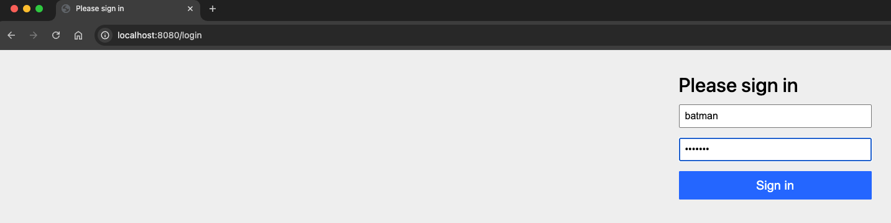
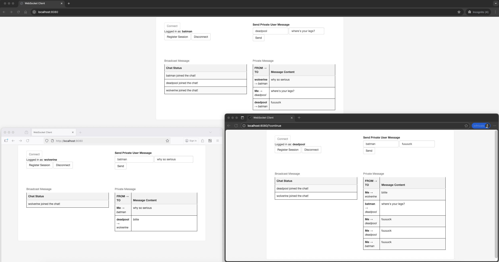

# ironoc-msg

[](https://github.com/conorheffron/ironoc-msg/actions/workflows/gradle.yml)

[](https://opensource.org/licenses/MIT)

### Overview
 - Sample client server messaging service over web sockets.

### Tech
 - JDK 17, Spring Messaging, STOMP js, Gradle 8

### Quick Start

### 1. Build Project
```shell
./gradlew clean build
```

### 2. Run Application
```shell
./gradlew bootRun
```

### 3. Open a series of browsers (Edge, Chrome, Firefox..), login, connect, register web socket session & see who is late to the conversation
```shell
http://localhost:8080/
```

#### Login (Spoofed Security for Demo Purposes)


#### Testing in various Browsers

